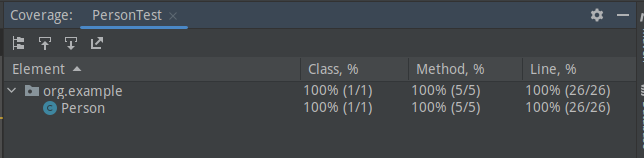
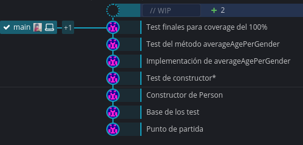

# Documentación
### Métodos creados
- Person -> constructor que recibe el nombre, la edad y el género
- averageAgePerGender -> devuelve la edad promedia de hombres y mujeres de una lista de personas

### Test a probar (el nombre describe qué comprueba el test, pero por si acaso)
- goodNameGetters -> devuelve correctamente el nombre de la persona
- noExceptions -> si se cumplen los casos bases
- emptyName -> no se crea una persona sin nombre
- badAge -> no se mete una edad irreal
- unknownGender -> no se permiten sexos no especificados
- noFemale -> edad promedia cuando solo hay hombres
- noMale -> edad promedia cuando solo hay mujeres
- mixGender -> edad promedia cuando hay mezcla (caso general)
- bigAgeValues -> edad promedia cuando la edad es inmesurablemente grande (por si acaso)
- zeroAgeValues -> media de edad de recién nacidos

## Coverage

## Git Kraken
Se han hecho dos ramas (main y develop, que se ven en el log), pero kraken se empeña en ponerlas del mismo color. Los dos cambios esos son de los archivos extras que se pide.

